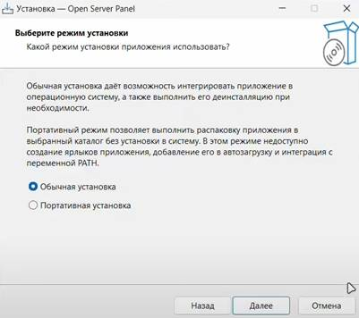
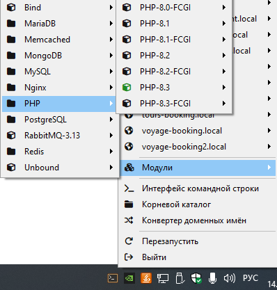
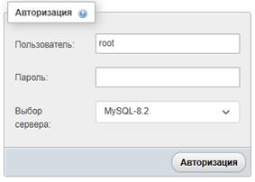
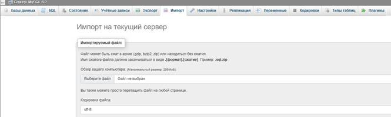

# Инструкция по развертыванию приложения

1. Скачайте файл установщика Open Server Panel (OSP). Рекомендуемая версия: 6.0.0.

2. Запустите файл установщика OSP.

   2.1. В установщике OSP доберитесь до выбора режима установки. В этом разделе выберите режим установки «Обычная установка».
   
   

   2.2. Доберитесь до выбора компонентов. Для нашего веб-приложения среди представленных компонентов необходимо обязательно выбрать для установки: PHP-8.3, MySQL-8.2.

3. Запустите Open Server Panel. У вас должен появиться в трее панели задач значок программы.

4. Убедитесь, что модули PHP-8.3 и MySQL-8.2 подключены. Для этого откройте контекстное меню OSP, наведите курсор на «Модули», далее наведите курсор на «PHP» - там вы увидите установленные вами версии PHP. Значок пункта «PHP-8.3» должен гореть зелёным, что означает, что модуль включён. Если же значок горит серым, наведите курсор на пункт «PHP-8.3» и нажмите «Включить». Проделайте аналогичные действия для MySQL-8.2.

   

5. Разархивируйте phpmyadmin.rar в директорию с проектами OSP (маршрут: `../OSPanel/home`). Разархивируйте также сам проект marine-booking-n-rent.local в эту же директорию. Кроме того, откройте директорию с сертификатами из директорий OSP (маршрут: `../OSPanel/data/ssl/projects`) – туда вам нужно перенести папки из архива файлов проекта, находящиеся по директории `../файлы проекта/ssl`, разархивируйте их и должны внутри `../OSPanel/data/ssl/projects` быть аналогичные по названию проекту две папки, внутри которых находятся сертификаты. После нажмите ПКМ по значку Open Server Panel в трее и нажмите «Перезапустить». Должно появиться два проекта в списке проектов, которые также можно увидеть в контекстном меню OSP.

6. Убедитесь, что для каждого из созданных двух проектов установлены компоненты следующим образом:
   - 6.1. Nginx – не используется;
   - 6.2. Node-20.17.0;
   - 6.3. PHP-8.3;

   Для этого наведите курсор на каждом из проектов - так отобразится меню, где можно выбирать версии этих компонентов. Если версии не совпали и их пришлось изменять, на всякий случай нажмите «Перезапустить» в контекстном меню OSP еще раз.

7. Откройте проект phpmyadmin. Наведите курсор из контекстного меню OSP на пункт проект phpmyadmin и там выберите «Открыть в браузере».

   7.1. Авторизуйтесь: пользователь – root, пароль отсутствует (пустое поле), выбор сервера – MySQL-8.2.
   
   

   7.2. Внутри на главной странице выберите сопоставление кодировки соединения: `utf8mb4_unicode_ci`.
   
   

   7.3. Далее в верхнем меню выберите «Импорт» и в качестве импортируемого файла загрузите `marine_booking.sql`. Пролистайте ниже и нажмите кнопку «Импорт».
   
   

8. Теперь можно запустить сам проект: ПКМ по OSP, наводим курсор по `marine-booking-n-rent.local` -> Открыть в браузере.

## About Laravel

Laravel is a web application framework with expressive, elegant syntax. We believe development must be an enjoyable and creative experience to be truly fulfilling. Laravel takes the pain out of development by easing common tasks used in many web projects, such as:

- [Simple, fast routing engine](https://laravel.com/docs/routing).
- [Powerful dependency injection container](https://laravel.com/docs/container).
- Multiple back-ends for [session](https://laravel.com/docs/session) and [cache](https://laravel.com/docs/cache) storage.
- Expressive, intuitive [database ORM](https://laravel.com/docs/eloquent).
- Database agnostic [schema migrations](https://laravel.com/docs/migrations).
- [Robust background job processing](https://laravel.com/docs/queues).
- [Real-time event broadcasting](https://laravel.com/docs/broadcasting).

Laravel is accessible, powerful, and provides tools required for large, robust applications.

## Learning Laravel

Laravel has the most extensive and thorough [documentation](https://laravel.com/docs) and video tutorial library of all modern web application frameworks, making it a breeze to get started with the framework.

You may also try the [Laravel Bootcamp](https://bootcamp.laravel.com), where you will be guided through building a modern Laravel application from scratch.

If you don't feel like reading, [Laracasts](https://laracasts.com) can help. Laracasts contains thousands of video tutorials on a range of topics including Laravel, modern PHP, unit testing, and JavaScript. Boost your skills by digging into our comprehensive video library.

## Laravel Sponsors

We would like to extend our thanks to the following sponsors for funding Laravel development. If you are interested in becoming a sponsor, please visit the [Laravel Partners program](https://partners.laravel.com).

### Premium Partners

- **[Vehikl](https://vehikl.com/)**
- **[Tighten Co.](https://tighten.co)**
- **[WebReinvent](https://webreinvent.com/)**
- **[Kirschbaum Development Group](https://kirschbaumdevelopment.com)**
- **[64 Robots](https://64robots.com)**
- **[Curotec](https://www.curotec.com/services/technologies/laravel/)**
- **[Cyber-Duck](https://cyber-duck.co.uk)**
- **[DevSquad](https://devsquad.com/hire-laravel-developers)**
- **[Jump24](https://jump24.co.uk)**
- **[Redberry](https://redberry.international/laravel/)**
- **[Active Logic](https://activelogic.com)**
- **[byte5](https://byte5.de)**
- **[OP.GG](https://op.gg)**

## Contributing

Thank you for considering contributing to the Laravel framework! The contribution guide can be found in the [Laravel documentation](https://laravel.com/docs/contributions).

## Code of Conduct

In order to ensure that the Laravel community is welcoming to all, please review and abide by the [Code of Conduct](https://laravel.com/docs/contributions#code-of-conduct).

## Security Vulnerabilities

If you discover a security vulnerability within Laravel, please send an e-mail to Taylor Otwell via [taylor@laravel.com](mailto:taylor@laravel.com). All security vulnerabilities will be promptly addressed.

## License

The Laravel framework is open-sourced software licensed under the [MIT license](https://opensource.org/licenses/MIT).

